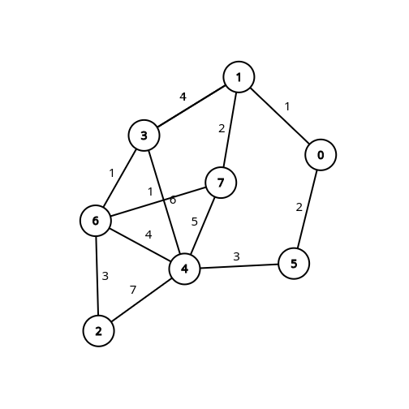
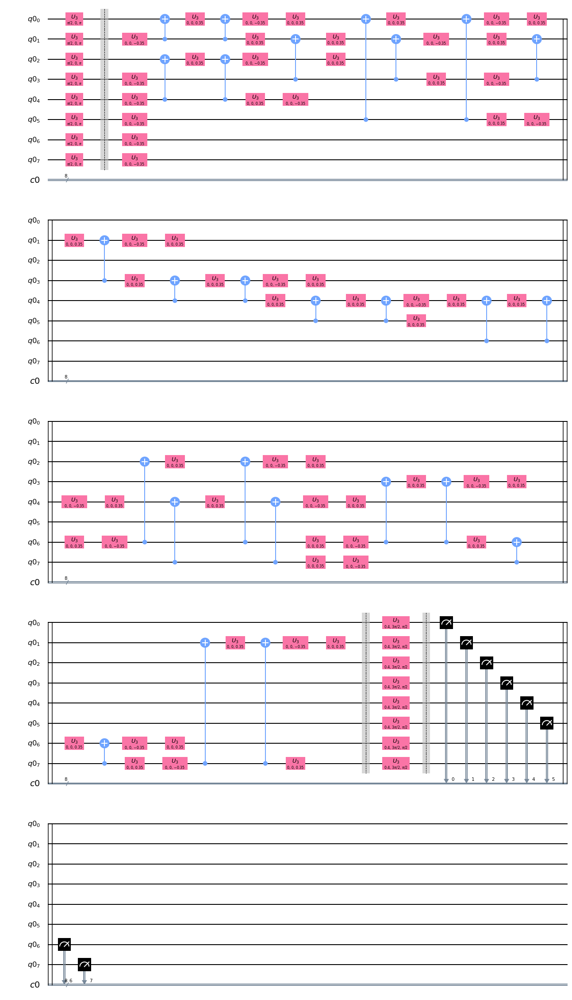
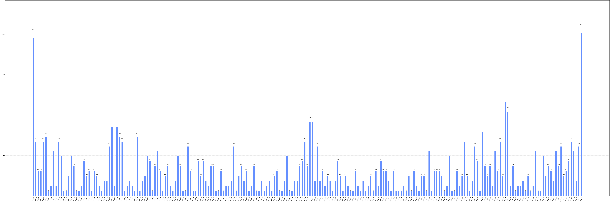

# MAXCUT Problem using QAOA

## Problem Statement

>The problem of finding a maximum cut in a graph is known as the Max-Cut Problem. The problem can be stated simply as follows. One wants a subset S of the vertex set such that the number of edges between S and the complementary subset is as large as possible. 
For more information regarding the problem statement click [here](https://www.cs.cmu.edu/afs/cs/academic/class/15854-f05/www/scribe/lec02.pdf)

## The weighted graph used in this experiment

### Dependencies 
> Qiskit == 0.19.2

> Numpy == 1.19.0

> Matplotlib == 3.2.1

> Networkx == 2.4

## Circuit of the model used in this experiment

> Here only universal quantum gates are used, that is, CNOT gate and U3 gate

## Result of the experiment

##### For more information regarding this click [here](https://qiskit.org/textbook/ch-applications/qaoa.html#5.-Qiskit-Implementation)
